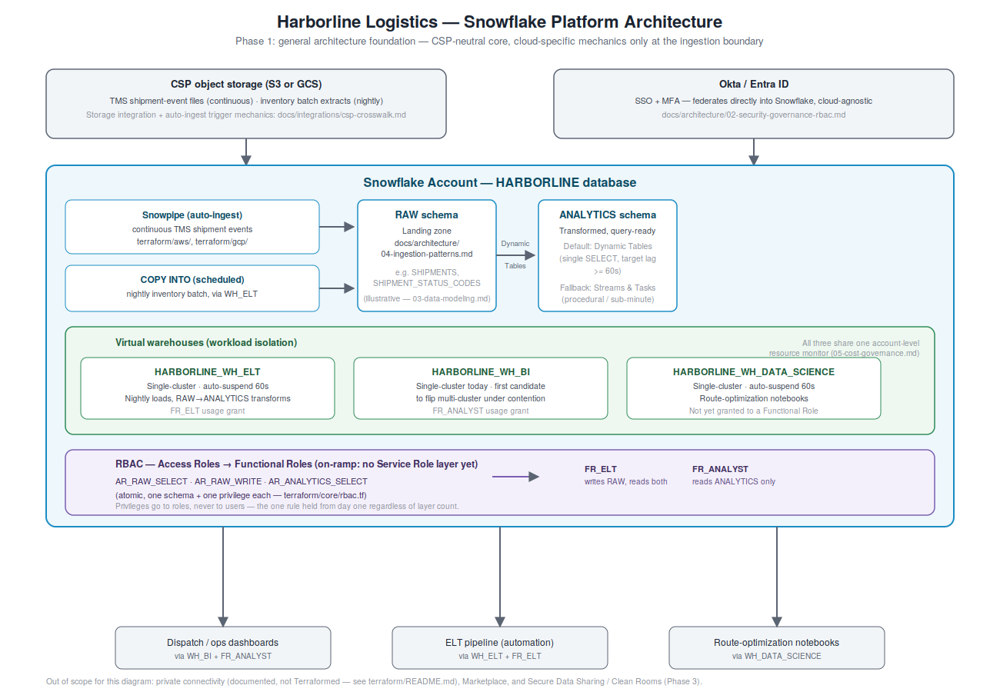

# Snowflake Reference Architecture

A worked example of a modern Snowflake platform for a company with real data volume and a
platform straining under it -- not a greenfield toy, not built for Amex- or Capital One-scale
requirements from day one. Covers account and warehouse architecture, security and
governance, data modeling, ingestion patterns, cost governance, open table formats, and
cross-cloud resilience, calibrated to what a growing organization actually needs first versus
what it grows into.

This repo builds in three phases: a general architecture foundation, a GenAI/Cortex-focused
narrowing of that same foundation, and a financial-services data warehouse variant. See
**Roadmap** below for what's built and what's still ahead.

## What this is, and is not

**Harborline Logistics is a fictional company**, built specifically for this project. It's a
mid-size logistics and distribution company -- real order, shipment, and inventory data
volume, not a hyperscale enterprise. Every technology named here (Snowflake, AWS, GCP) is
real and current; the company, its data, and its operations are not. Phase 3 introduces a
second, separate fictional company, **Éclairage des Lanternes** (`lanternes` in Terraform
and identifiers) -- a payments processor, needing a genuinely different starting condition
than Harborline's rather than a domain stretched to fit.

This is **reference architecture and reasoning**, not a production system. Nothing here has
been run against a live Snowflake account, reviewed by a third-party auditor, or checked by a
second practicing architect. Where Terraform exists, `terraform validate` passing means the
code is schema-correct, not that it would apply cleanly against a real account -- that gap
only closes by actually testing it against a sandbox environment. Treat this as a strong
starting point for real Snowflake architecture work, not as something already operated in
production.

Several sections draw on Snowflake's own white papers for capability categories and
terminology. That material is treated as a capability map, not independent verification --
marketing claims (benchmark numbers, "near-instant" language) are flagged for verification
against docs and behavior rather than repeated as fact. Source documents themselves live in a
local, private research directory that is not part of this repo and is not synced to GitHub.

## Architecture diagram

Ingestion, the RAW/ANALYTICS schema split, workload-isolated warehouses, and the RBAC
on-ramp -- the same pieces docs 01-04 cover in prose, laid out as one picture. Source is
`harborline_snowflake_platform_hld.svg`.

## Structure

| Path | What is there |
|---|---|
| `docs/architecture/00-overview.md` | Scope, ground rules, Harborline Logistics, section index, open items |
| `docs/architecture/01-account-warehouse.md` | Workload isolation, multi-cluster scaling, auto-suspend/resume, warehouse access control |
| `docs/architecture/02-security-governance-rbac.md` | Four-layer RBAC hierarchy with scale on-ramp, Horizon Catalog, data masking, SSO/MFA |
| `docs/architecture/03-data-modeling.md` | Micro-partitions, clustering keys -- when to use them and when not to |
| `docs/architecture/04-ingestion-patterns.md` | COPY INTO, Snowpipe, Snowpipe Streaming, Dynamic Tables, Streams & Tasks -- a decision framework, not a feature list |
| `docs/architecture/05-cost-governance.md` | Resource monitors, usage-based pricing, and why auto-suspend actually matters |
| `docs/architecture/06-open-table-formats.md` | Iceberg Tables, catalog choice (Snowflake / external / Apache Polaris) |
| `docs/architecture/07-cross-cloud-resilience.md` | Snowgrid replication/failover -- deliberately lighter-weight, held to the same skepticism as the rest of this repo |
| `docs/integrations/csp-crosswalk.md` | AWS vs. GCP mechanics: storage integration (IAM role vs. service account), Snowpipe triggers (SQS/SNS vs. Pub/Sub), private connectivity (PrivateLink vs. Private Service Connect) |
| `docs/genai/00-overview.md` | Phase 2 scope: what's covered (Cortex Analyst/Search/Agents) and what's deliberately deferred (Document AI, Cortex Functions, Snowflake ML) |
| `docs/genai/01-cortex-analyst.md` | Semantic views (the modern, Terraformed replacement for the legacy YAML semantic model), natural-language-to-SQL |
| `docs/genai/02-cortex-search.md` | Hybrid semantic + keyword search over unstructured text, kept fresh via target_lag |
| `docs/genai/03-cortex-agents.md` | Orchestration/tool-routing, and why an agent needs no identity of its own |
| `docs/genai/04-cortex-governance.md` | Where Harborline's agent sits on an AI-adoption maturity model borrowed from a companion repo, and what Cortex governs natively versus what a dedicated agent-governance platform would add |
| `docs/fin-warehouse/00-overview.md` | Phase 3: what's different for Éclairage des Lanternes (payments) vs. Harborline's general foundation |
| `docs/sharing/sharing-clean-rooms.md` | Secure Data Sharing and Data Clean Rooms: the aggregation-as-privacy-boundary pattern, and where the two diverge |
| `terraform/core/` | Cloud-agnostic Snowflake resources: resource monitor, warehouses, database/schemas, RBAC |
| `terraform/aws/` | S3 + IAM storage integration, direct S3-to-SQS Snowpipe auto-ingest |
| `terraform/gcp/` | GCS + service-account storage integration, GCS-notification-to-Pub/Sub Snowpipe auto-ingest |
| `terraform/genai/` | A Cortex Analyst semantic view, a Cortex Search service, and a Cortex Agent tying both together |
| `terraform/sharing/` | A classified, row-access-scoped column, a pre-aggregated secure view with small-cell suppression, and a share exposing only that view -- no masking policy (removed after a self-review found it protected nothing) |
| `harborline_snowflake_platform_hld.svg` / `.png` | Phase 1 architecture diagram |
| `examples/` | Placeholder -- empty until the architecture docs are stable enough to demonstrate concretely against Harborline |

## Roadmap

- **Phase 1 -- General architecture (complete).** The seven architecture docs, the CSP
  crosswalk doc, Terraform (core/aws/gcp, all `terraform validate`-clean), Harborline's
  examples woven through sections 01-04, and the HLD diagram are all built. A later
  adversarial self-review against `core/`, `aws/`, and `genai/` found and fixed a missing
  RBAC path to `HARBORLINE_WH_DATA_SCIENCE`, a dead Terraform variable a GenAI doc had
  wrongly described as real, an over-broad AWS IAM grant, and two stale status lines --
  see `terraform/README.md`.
- **Phase 2 -- GenAI/Cortex narrowing (complete for its chosen scope).** Cortex Analyst
  (via semantic views), Cortex Search, and Cortex Agents -- docs and Terraform
  (`terraform/genai/`, `terraform validate`-clean), still on Harborline. Document AI, Cortex
  Functions, and Snowflake ML were deliberately scoped out -- see `docs/genai/00-overview.md`.
  A governance doc (`docs/genai/04-cortex-governance.md`) cross-links a companion repo,
  `ai_agent_governance_patterns`, for the deeper AI-adoption maturity and platform-governance
  reasoning this phase's use case does not yet need in full.
- **Phase 3 -- Fin data warehouse variant (complete for its chosen scope).** Éclairage des
  Lanternes (payments processor), a focused variant doc rather than a full 00-07 rebuild,
  and the Sharing & Data Clean Rooms doc as the centerpiece -- plus Terraform
  (`terraform/sharing/`, `terraform validate`-clean) for the privacy-preserving primitives
  underneath it.

## License

MIT. See `LICENSE`. Use the reasoning or any Terraform that lands here for your own Snowflake
work.
